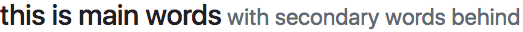

## Bootstrap 官方文档研习
---
### HTML5 doctype
>Bootstrap 要求设置 HTML5 doctype。如果没有这个设置，你会看到一些奇怪的、不完整的样式，但是只要添加了这个设置就不会出现任何错误了。
```html
<!doctype html>
<html lang="en">
  ...
</html>
```
---
### Nav  
**Navigation in navbars will also grow to occupy as much horizontal space as possible** to keep your navbar contents securely aligned\.   

---
### 如何使用collapse
>Be sure to add aria-expanded to the control element. This attribute explicitly conveys the current state of the collapsible element tied to the control to screen readers and similar assistive technologies. If **the collapsible element is closed** by default, **the attribute on the control element should have a value of aria-expanded="false"**. If you’ve set the collapsible element to be open by default using the show class, set aria-expanded="true" on the control instead. The plugin will automatically toggle this attribute on the control based on whether or not the collapsible element has been opened or closed (via JavaScript, or because the user triggered another control element also tied to the same collapsbile element). **If the control element’s HTML element is not a button** \(e.g.\, an \<a> or \<div>)\, the attribute role="button" should be added to the element\.  

aria-expended决定一个折叠元素是否要默认展开，如果控制折叠的元素不是button，那么还需要加上role=“button”来标明这是一个按钮的角色。  

>If your control element is targeting a single collapsible element – i.e. the **data-target** attribute is pointing to an id selector – you should add the **aria-controls** attribute to the control element, containing the id of the collapsible element. Modern screen readers and similar assistive technologies make use of this attribute to provide users with additional shortcuts to navigate directly to the collapsible element itself.   

```html
<p>
  <a class="btn btn-primary" data-toggle="collapse" href="#collapseExample" role="button" aria-expanded="false" aria-controls="collapseExample">
    Link with href
  </a>
  <button class="btn btn-primary" type="button" data-toggle="collapse" data-target="#collapseExample" aria-expanded="false" aria-controls="collapseExample">
    Button with data-target
  </button>
</p>
<div class="collapse" id="collapseExample">
  <div class="card card-body">
    Anim pariatur cliche reprehenderit, enim eiusmod high life accusamus terry richardson ad squid. Nihil anim keffiyeh helvetica, craft beer labore wes anderson cred nesciunt sapiente ea proident.
  </div>
</div>
```
### Screenreaders
Use screenreader utilities to hide elements on all devices except screen readers.

Hide an element to all devices except screen readers with .sr-only. Combine .sr-only with .sr-only-focusable to show the element again when it’s focused (e.g. by a keyboard-only user). Can also be used as mixins.
```css
// Usage as a mixin
.skip-navigation {
  @include sr-only;
  @include sr-only-focusable;
}
```
该属性对所有设备都不可见，只有screenreader才能显示出来。
>A screen reader is a form of assistive technology (AT) which is essential to people who are blind, as well as useful to people who are visually impaired, illiterate, or have a learning disability. Screen readers are software applications that attempt to convey what people with normal eyesight see on a display to their users via non-visual means, like text-to-speech,[4], sound icons,[5] or a Braille device.[2] They do this by applying a wide variety of techniques that include for example interacting with dedicated accessibility APIs, using various operating system features (like inter-process communication and querying user interface properties) and employing hooking techniques. [6] 即，盲人使用的读屏辅助设备。

### 自定义Headings
可以在headings中创建小一号的次标题字。
```html
<h3>this is main words<small class="text-muted"> with secondary words behind</small></h3>
```
  

### text-capitalize首字母大写
只改变每个单词的第一个字母，其他字母不受影响。
```html
<p class="text-capitalize">CapiTaliZed text.</p>
```
### quick generate a inline lists
```html
    <ul class="list-inline">
        <li class="list-inline-item">Lorem ipsum5</li>
        <li class="list-inline-item">Lorem ipsum6</li>
        <li class="list-inline-item">Lorem ipsum7</li>
    </ul>
```
### \<a>设置成button的disable有点不同
- a标签不支持disable属性，所以得通过.disable来应用disable属性
```html
<a href="#" class="btn btn-primary btn-lg disabled" role="button" aria-disabled="true">Primary link</a>
<a href="#" class="btn btn-secondary btn-lg disabled" role="button" aria-disabled="true">Link</a>
```

### justify-content-*属性需要放在class属性的最后
justify-content-between或者justify-content-center需要放在class属性的最后才能起到调整布局的作用。
```html
    <div class="btn-toolbar justify-content-between" role="toolbar" aria-label="Toolbar with button groups">
        <div class="btn-group" role="group" aria-label="First group">
            <button type="button" class="btn btn-secondary">1</button>
            <button type="button" class="btn btn-secondary">2</button>
            <button type="button" class="btn btn-secondary">3</button>
            <button type="button" class="btn btn-secondary">4</button>
        </div>
        <div class="input-group">
            <div class="input-group-prepend">
                <div class="input-group-text" id="btnGroupAddon2">@</div>
            </div>
            <input type="text" class="form-control" placeholder="Input group example" aria-label="Input group example" aria-describedby="btnGroupAddon2">
        </div>
    </div>
```